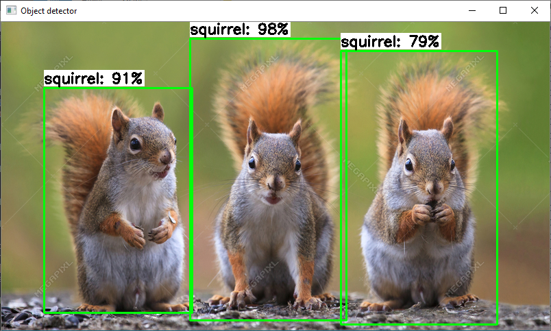

# TensorFlow-Lite-Object-Detection-on-Android-and-Raspberry-Pi
A guide showing how to train TensorFlow Lite object detection models and run them on Android, the Raspberry Pi, and more!

<p align="center">
   
</p>

## Introduction
TensorFlow Lite is an optimized framework for deploying lightweight deep learning models on resource-constrained edge devices. TensorFlow Lite models have faster inference time and require less processing power, so they can be used to obtain faster performance in realtime applications. This guide provides step-by-step instructions for how train a custom TensorFlow Object Detection model, convert it into an optimized format that can be used by TensorFlow Lite, and run it on Android phones or the Raspberry Pi.
's what your \object_detection folder should look like:
  

For more information on options that can be used while running the scripts, use the `-h` option when calling the script. For example:

```
python  image.py -h
```

##### Webcam
Make sure you have a USB webcam plugged into your computer. If you’re on a laptop with a built-in camera, you don’t need to plug in a USB webcam. 

From the  object_detection directory, issue: 

```
python  webcam.py 
```

After a few moments of initializing, a window will appear showing the webcam feed. Detected objects will have bounding boxes and labels displayed on them in real time.

##### Video
To run the video detection script, issue:

```
python video.py
```

A window will appear showing consecutive frames from the video, with each object in the frame labeled. Press 'q' to close the window and end the script. By default, the video detection script will open a video named 'test.mp4'. To open a specific video file, use the `--video` option:

```
python image.py  --video='test.avi'
```

Note: Video detection will run at a slower FPS than realtime webcam detection. This is mainly because loading a frame from a video file requires more processor I/O than receiving a frame from a webcam.

##### Image
To run the image detection script, issue:

```
python  image.py --modeldir=data
```

The image will appear with all objects labeled. Press 'q' to close the image and end the script. By default, the image detection script will open an image named 'test1.jpg'. To open a specific image file, use the `--image` option:

```
python image.py  --image=squirrel.jpg
```

It can also open an entire folder full of images and perform detection on each image. There can only be images files in the folder, or errors will occur. To specify which folder has images to perform detection on, use the `--imagedir` option:

```
python image.py   --imagedir=data
```

Press any key (other than 'q') to advance to the next image. Do not use both the --image option and the --imagedir option when running the script, or it will throw an error.

<p align="center">
   
</p>

 
